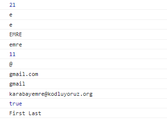

# stringDataTypeOperations

## Öğrenilen kavramlar

- charAt(0)
- toUpperCase()
- toLowerCase()
- search("@")
- slice( email.search("@") + 1)
- slice(0, DOMAIN.indexOf('.'))
- replace('gmail.com', 'kodluyoruz.org')
- includes('dkfhsd')
- endsWith('kodluyoruz.org')

### console

